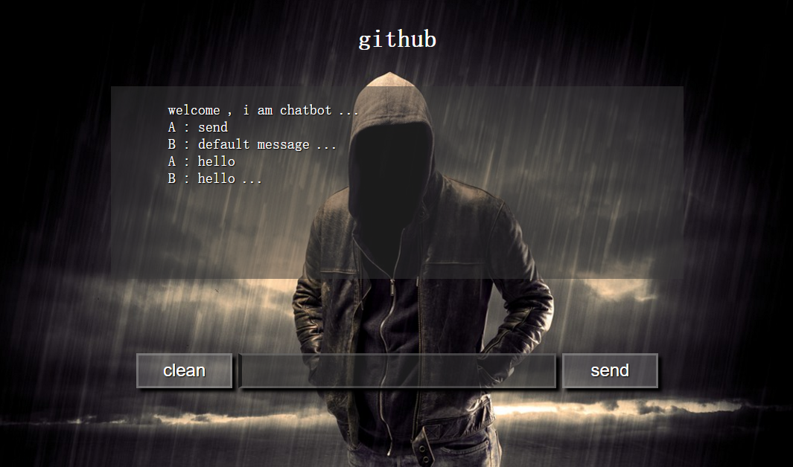

#  基于AIML的PHP聊天天机器人  from [ChatBot](https://github.com/kompasim/chatbot)


## 0. 安装

`composer require 'lyfing\laravel-chatbot'`
## 1. 配置


添加  `Lyfing\ChatBot\ChatBotServiceProvider::class,` 到 config/app.php `providers`  


## 2. 发布

>  ` php artisan vendor:publish` 


## 4. 配置 config

> 你可以直接编辑 `config/chatbot.php` 文件

## 5. 配置 aiml

> 编辑 `storage/chatbot/aiml` 目录下文件

> * `chatbot.aiml` 是入口文件 ，它里面的 `aiml` 标签可以包含多个 `category` 标签 , 一个 `default`标签和多个 `include`标签。

> *  被你添加的其它 `aiml` 文件在根`aiml`标签里必须要包含一个 `topic` 标签 , 这个topic标签可以包含多个 `category` 标签和一个`default`标签 (这里的其他aiml文件不能写`include`标签，`include`标签只能出现在`chatbot.aiml`文件里)。


## 6. 测试聊天机器人

> 你可以打开 `http://127.0.0.1:/chatbot`进行和机器人聊天做测试。


## 7. 调用聊天机器人

> 如果希望在自己的应用里面调用聊天机器人我们可以这样调用它的api `api?requestType=talk&userInput=hello`

## 8. 关于匹配规则

> 修改之后的匹配规则 :

```PHP
* ---> (\S+)
# ---> \S+
_ ---> .*
= ---> \S*
```

## 9. 关于AIML标签

> 本聊天机器人的`aiml`标签和标准`aiml`标签有所不同，我根据需求对标签做了一些个性化，我们可以在[AIML.MD](AIML.md)文件里面查到更多本聊天机器人所支持的标签。

## 14. 关于数据库

> `log` 存储日志的表 . 

> `property` 是存储`user`和`bot`的有关属性的表 , 相当于我们聊天机器人的脑袋，帮我们记住一些属性。 set ,get, del, user, bot 等标签是用来操作这个表的 .

> `data` 表用来存储用户的输入，机器人的回复，`input `, `that`, `topic` 等标签会操作`Parser::$_data`数组，每次程序开始运行的时候程序会从这个表加载数据到这个数组里，然后程序要结束的时候再会存储到这个表里面。表的唯一标示还是`userId`。


---

#  Enjoy it

> [详情查看](https://github.com/kompasim/chatbot)

